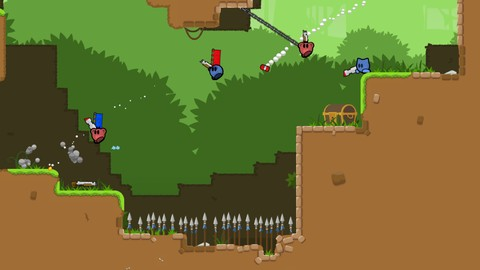
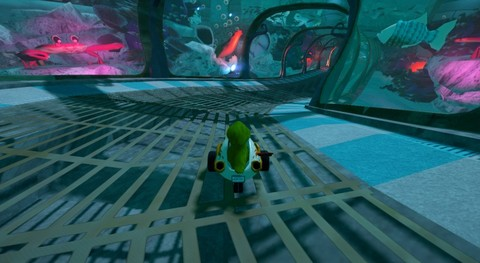
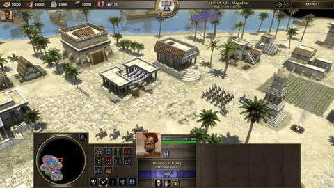
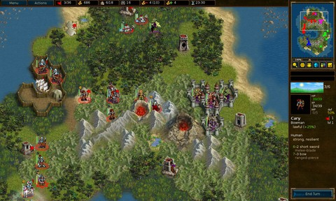
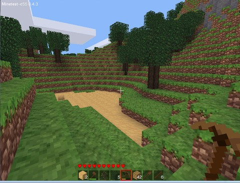
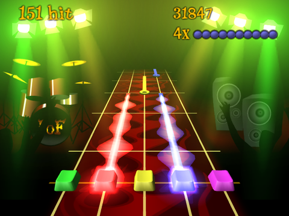
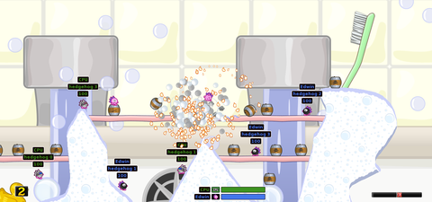
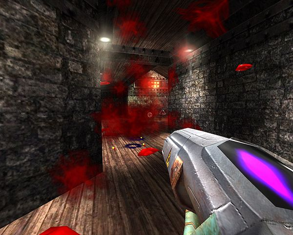
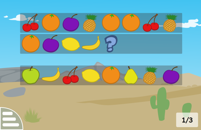

% Jeux vidéos libres

---
lang: fr
geometry: margin=1.25in
urlcolor: blue
...

# Teeworlds

{width="180"}

Jeu multijoueur d'action/arcade en 2D cartoonesque assez rapide, très simple à prendre en main en LAN ou via le net.

Vous incarnez une petite créature ronde, le tee, qui utilise un grappin pour se déplacer. À l'aide de différentes armes, en équipe ou seul, pour voler le drapeau à ses adversaires, ou tous les tuer, selon le mode de jeu.

[teeworlds.com](https://teeworlds.com/)

# SuperTuxKart

{width="180"}

Jeu de course avec une variétés de modes, de cartes et de karts. Plus une campagne solo !

[supertuxkart.net](https://supertuxkart.net/)

# 0 A.D.

{width="180"}

Jeu vidéo de stratégie en temps réel développé et édité par Wildfire Games pour Windows, GNU/Linux et Mac OS.

[play0ad.com](https://play0ad.com/)

# Battle for wesnoth

{width="180"}

Jeu vidéo de stratégie au tour par tour dans un univers médiéval fantastique.

En mode solo plusieurs campagnes racontent l'histoire du royaume de Wesnoth. Un grand nombre de campagnes sont mises librement à disposition pour la communauté. Le jeu a aussi un mode multijoueur via internet ou en local.

[wesnoth.org](https://www.wesnoth.org/)

# Minetest

{width="180"}

Jeu de type «bac à sable» où vous réaménagez un terrain constitué de blocs cubiques aux graphismes pixel-art. L'installation est simple et le jeu est entièrement traduit en français.

C'est aussi un serveur qui permet d'accueillir vos amis ou simplement quelques visiteurs curieux voire même des joueurs chevronnés.

[minetest.net](https://www.minetest.net/)

# Frets on Fire

{width="180"}

Jeu de simulation de guitare pour améliorer sa dextérité au clavier tout en s'amusant.

[fretsonfire.sourceforge.net](http://fretsonfire.sourceforge.net/)

# Hedgewars

{width="180"}

Clone de Worms, jeu de stratégie au tour par tour dans lequel plusieurs équipes de hérissons s'entretuent.

[hedgewars.org](http://www.hedgewars.org/)

# OpenArena

{width="180"}

Jeu FPS offrant un système de parcours innovant et au rythme haletant !

[openarena.ws](http://openarena.ws)

# Khaganat / Khanat

{width="180"}

Jeu MMORPG et sa communauté, Khanat est l'univers de ce jeu.

[khaganat.net](https://khaganat.net/)

# GCompris

{width="180"}

Logiciel éducatif qui propose des activités variées aux enfants de 2 à 10 ans.

[gcompris.net](http://gcompris.net/)

# Crédits et ressources

Source des notices :

* l'annuaire des jeux libres [jeuxlibres.net](http://jeuxlibres.net/)
* La section jeux de l'annuaire des logiciels libres [framalibre.org](https://framalibre.org/annuaires/jeux)

[^framalibre]: Source: [framalibre.org](https://framalibre.org/annuaires/jeux)
[^jeuxlibres]: Source: [jeuxlibres.net](http://jeuxlibres.net/)
